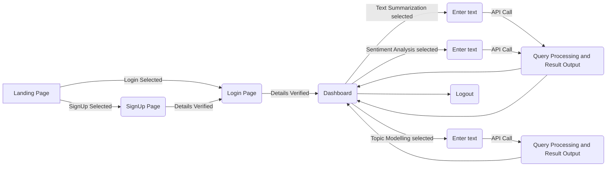

# NLPHub
This website(Hosted on render: https://nlphub-web.onrender.com/) aims at providing basic NLP features to the registered user which includes various features like Text Summarization, Topic Modelling and Sentiment Analysis.

## Approach

The website is build using HTML and Bootstrap as front-end and NodeJS as back-end. 
1. The site starts with a landing page.
2. The user is given with two options:
			  a. Login(For Existing Users)
			  b. Sign Up(For new users)
3. Login is built using Passport.JS with a local strategy which can be easily converted to use automatic  logins like Google.
4. After logging in, the user lands on dashboard where he/she is provided with options to choose the feature they want
5. Then they can enter the text they want to perform the operation on.
6. The site communicates with a developed API to process the query and get the result

## Flow Chart

## Snippets
Landing Page:

Login Page:

SignUp Page:

Dashboard:

Change Password Page:

Action:

Result:

